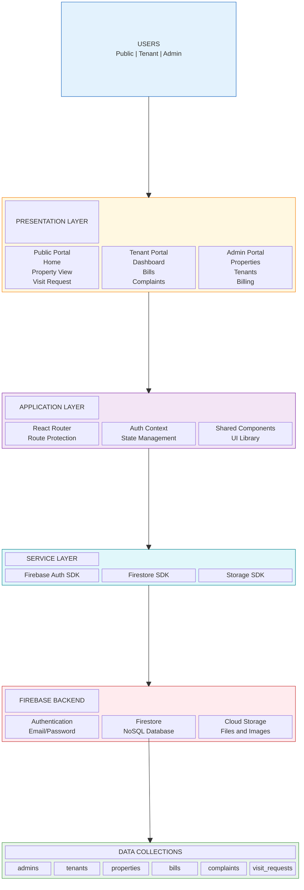

# PG Management System Architecture

---

| Layer | Components | Responsibility |
|-------|------------|----------------|
| **Presentation** | Public, Tenant, Admin Portals | User interface and interactions |
| **Application** | Router, Context, Components | Business logic and state |
| **Service** | Firebase SDKs | API communication |
| **Backend** | Auth, Firestore, Storage | Data persistence and security |
| **Data** | 6 Collections | Domain entities storage |

---

*February 2026*
