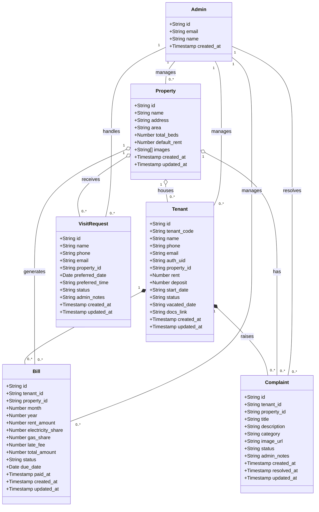

# PG Management System Class Diagram

---

## Class Descriptions

| Class | Description | Firebase Collection |
|-------|-------------|---------------------|
| **Admin** | System administrator with full access to manage properties, tenants, and billing | `admins` |
| **Tenant** | Registered tenant living in a PG property | `tenants` |
| **Property** | PG accommodation with multiple beds | `properties` |
| **Bill** | Monthly bill generated for each tenant | `bills` |
| **Complaint** | Issue/complaint raised by tenant | `complaints` |
| **VisitRequest** | Visit request from potential tenant | `visit_requests` |

---

## Attribute Details

### Tenant Status Values
- `Pending` - Registered but not assigned property
- `Active` - Currently residing in property
- `Vacated` - Left the property

### Bill Status Values
- `Pending` - Bill generated, awaiting payment
- `ReportedPaid` - Tenant marked as paid, awaiting verification
- `Paid` - Payment verified by admin
- `Overdue` - Past due date, unpaid

### Complaint Status Values
- `Open` - New complaint registered
- `InProgress` - Being addressed
- `Resolved` - Issue resolved

### Complaint Category Values
- `Electrical`
- `Water`
- `Cleaning`
- `Maintenance`
- `Other`

### VisitRequest Status Values
- `New` - Fresh request
- `Contacted` - Admin contacted the visitor
- `Completed` - Visit completed

---

## Relationship Summary

| Relationship | Type | Description |
|--------------|------|-------------|
| Property → Tenant | 1 to Many | One property can house multiple tenants |
| Tenant → Bill | 1 to Many | One tenant can have multiple bills |
| Tenant → Complaint | 1 to Many | One tenant can raise multiple complaints |
| Property → VisitRequest | 1 to Many | One property can receive multiple visit requests |
| Admin → All | Management | Admin manages all entities |

---

*February 2026*
