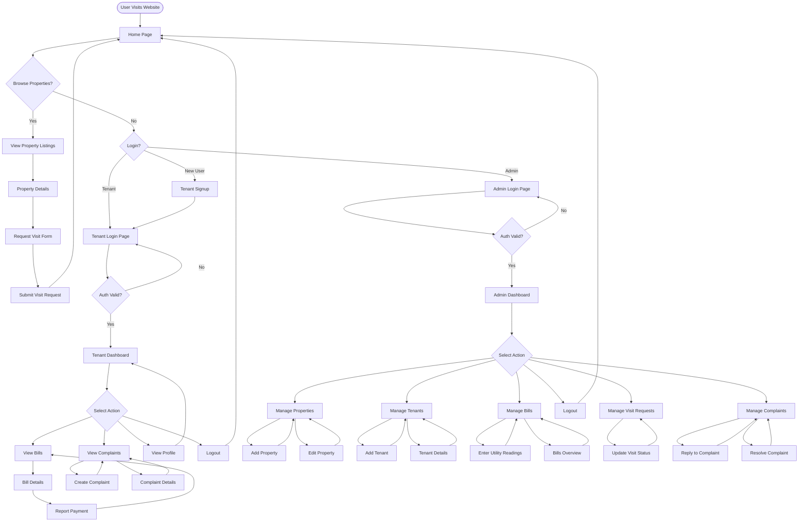

# PG Management System Flowchart

## Application User Flow

---

## Legend

| Symbol | Meaning |
|--------|---------|
| Rounded rectangle | Start/End point |
| Rectangle | Process/Page |
| Diamond | Decision point |
| Arrow | Flow direction |

---

*February 2026*
