# PG Management System - Sequence Diagram

```mermaid
sequenceDiagram
    autonumber
    
    %% Actors and Participants
    actor User as 👤 User
    participant UI as Interface<br/>(React UI)
    participant Auth as Authentication<br/>(Firebase Auth)
    participant Service as Service Layer<br/>(Firestore SDK)
    participant DB as Database<br/>(Firestore)

  

    %% === TENANT FLOWS ===
    rect rgb(232, 245, 233)
        Note over User,DB: Tenant Operations
        
        User->>UI: View Dashboard
        UI->>Service: getDashboardData(tenantId)
        Service->>DB: Query bills, complaints
        DB-->>Service: Dashboard Data
        Service-->>UI: Formatted Response
        UI-->>User: Display Dashboard
        
        User->>UI: View Bills
        UI->>Service: getBills(tenantId)
        Service->>DB: Query bills collection
        DB-->>Service: Bills List
        Service-->>UI: Bills Data
        UI-->>User: Display Bills
        
        User->>UI: Report Payment
        UI->>Service: updatePayment(billId, paymentInfo)
        Service->>DB: Update bill document
        DB-->>Service: Update Confirmed
        Service-->>UI: Success Response
        UI-->>User: Payment Recorded
        
        User->>UI: Create Complaint
        UI->>Service: addComplaint(complaintData)
        Service->>DB: Insert into complaints
        DB-->>Service: Complaint ID
        Service-->>UI: Success Response
        UI-->>User: Complaint Submitted
    end

    %% === ADMIN FLOWS ===
    rect rgb(255, 243, 224)
        Note over User,DB: Admin Operations
        
        User->>UI: Manage Properties
        UI->>Service: getProperties()
        Service->>DB: Query properties
        DB-->>Service: Properties List
        Service-->>UI: Properties Data
        UI-->>User: Display Properties
        
        User->>UI: Add/Edit Property
        UI->>Service: saveProperty(propertyData)
        Service->>DB: Insert/Update property
        DB-->>Service: Property Saved
        Service-->>UI: Success Response
        UI-->>User: Property Updated
        
        User->>UI: Manage Tenants
        UI->>Service: getTenants()
        Service->>DB: Query tenants
        DB-->>Service: Tenants List
        Service-->>UI: Tenants Data
        UI-->>User: Display Tenants
        
        User->>UI: Enter Utility Readings
        UI->>Service: saveUtilityReading(data)
        Service->>DB: Update tenant utilities
        DB-->>Service: Bill Generated
        Service-->>UI: Bill Details
        UI-->>User: Bill Created
        
        User->>UI: Respond to Complaint
        UI->>Service: updateComplaint(id, reply)
        Service->>DB: Update complaint doc
        DB-->>Service: Update Confirmed
        Service-->>UI: Success Response
        UI-->>User: Reply Sent
    end

    %% === PUBLIC FLOWS ===
    rect rgb(243, 229, 245)
        Note over User,DB: Public User Operations
        
        User->>UI: Browse Properties
        UI->>Service: getPublicProperties()
        Service->>DB: Query active properties
        DB-->>Service: Property List
        Service-->>UI: Properties Data
        UI-->>User: Display Properties
        
        User->>UI: Request Visit
        UI->>Service: createVisitRequest(data)
        Service->>DB: Insert visit_request
        DB-->>Service: Request ID
        Service-->>UI: Success Response
        UI-->>User: Visit Request Submitted
        
        User->>UI: Sign Up
        UI->>Auth: createUser(email, password)
        Auth-->>UI: New User Created
        UI->>Service: saveTenantProfile(userData)
        Service->>DB: Insert into tenants
        DB-->>Service: Tenant Created
        Service-->>UI: Success Response
        UI-->>User: Account Created
    end
```

---

## Sequence Diagram Legend

| Element | Description |
|---------|-------------|
| **User** | End user (Visitor, Tenant, or Admin) |
| **Interface** | React-based frontend UI |
| **Authentication** | Firebase Authentication service |
| **Service Layer** | Firestore SDK for data operations |
| **Database** | Firebase Firestore NoSQL database |

---

## Key Flows Covered

| Category | Operations |
|----------|------------|
| **Authentication** | Login, Password Reset |
| **Tenant** | Dashboard, Bills, Payments, Complaints |
| **Admin** | Properties, Tenants, Utilities, Complaint Mgmt |
| **Public** | Browse Properties, Visit Requests, Sign Up |

---

*February 2026*
