# PG Management System - Use Case Diagram

```mermaid
flowchart TB
    %% Actors (Left Side)
    Visitor(["👤 Visitor"])
    Tenant(["👤 Tenant"])
    Admin(["👤 Admin"])

    %% System Boundary
    subgraph System["🏢 PG Management System"]
        
        subgraph Public["Public Features"]
            UC1["View Properties"]
            UC2["View Property Details"]
            UC3["Request Visit"]
        end
        
        subgraph Auth["Authentication"]
            UC4["Login"]
            UC5["Signup"]
            UC6["Logout"]
        end
        
        subgraph TenantFeatures["Tenant Features"]
            UC7["View Dashboard"]
            UC8["View Bills"]
            UC9["Report Payment"]
            UC10["View Complaints"]
            UC11["Create Complaint"]
            UC12["View Profile"]
        end
        
        subgraph AdminFeatures["Admin Features"]
            UC13["Manage Properties"]
            UC14["Add Property"]
            UC15["Edit Property"]
            UC16["Manage Tenants"]
            UC17["Add Tenant"]
            UC18["View Tenant Details"]
            UC19["Enter Utility Readings"]
            UC20["View Bills Overview"]
            UC21["Manage Visit Requests"]
            UC22["Manage Complaints"]
            UC23["Reply to Complaint"]
            UC24["Resolve Complaint"]
        end
    end

    %% Visitor Associations
    Visitor --> UC1
    Visitor --> UC2
    Visitor --> UC3
    Visitor --> UC5
    
    %% Tenant Associations
    Tenant --> UC4
    Tenant --> UC6
    Tenant --> UC7
    Tenant --> UC8
    Tenant --> UC10
    Tenant --> UC12
    
    %% Admin Associations
    Admin --> UC4
    Admin --> UC6
    Admin --> UC7
    Admin --> UC13
    Admin --> UC16
    Admin --> UC19
    Admin --> UC20
    Admin --> UC21
    Admin --> UC22

    %% Include Relationships
    UC8 -.->|include| UC9
    UC10 -.->|include| UC11
    UC13 -.->|include| UC14
    UC13 -.->|include| UC15
    UC16 -.->|include| UC17
    UC16 -.->|include| UC18
    UC22 -.->|include| UC23
    UC22 -.->|include| UC24

    %% Styling
    style Visitor fill:#e3f2fd,stroke:#1976d2,stroke-width:2px
    style Tenant fill:#e8f5e9,stroke:#388e3c,stroke-width:2px
    style Admin fill:#fff3e0,stroke:#f57c00,stroke-width:2px
    style System fill:#fafafa,stroke:#424242,stroke-width:2px
    style Public fill:#e1f5fe,stroke:#0288d1
    style Auth fill:#f3e5f5,stroke:#7b1fa2
    style TenantFeatures fill:#e8f5e9,stroke:#388e3c
    style AdminFeatures fill:#fff3e0,stroke:#f57c00
```

---

## Actors

| Actor | Description |
|-------|-------------|
| **Visitor** | Unauthenticated user browsing properties |
| **Tenant** | Registered tenant with active account |
| **Admin** | System administrator managing PG operations |

---

## Use Cases Summary

| Actor | Use Cases |
|-------|-----------|
| **Visitor** | View Properties, View Property Details, Request Visit, Signup |
| **Tenant** | Login, Dashboard, Bills → Report Payment, Complaints → Create, Profile, Logout |
| **Admin** | Login, Dashboard, Manage Properties/Tenants, Utility Readings, Bills Overview, Visit Requests, Complaints, Logout |

---

## Relationship Legend

| Symbol | Type | Meaning |
|--------|------|---------|
| `→` | Association | Actor interacts with use case |
| `-.->` | Include | Use case always includes another |

---

*February 2026*
