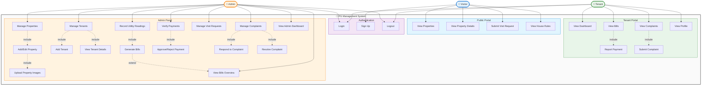

# PG Management System - Use Case Diagram

```mermaid
flowchart TB
    %% Actors
    Visitor(["👤 Visitor"])
    Tenant(["👤 Tenant"])
    Admin(["👤 Admin"])

    %% System Boundary
    subgraph System["🏢 PG Management System"]
        
        subgraph Public["Public Portal"]
            UC1["View Properties"]
            UC2["View Property Details"]
            UC3["Submit Visit Request"]
            UC4["View House Rules"]
        end
        
        subgraph Auth["Authentication"]
            UC5["Login"]
            UC6["Sign Up"]
            UC7["Logout"]
        end
        
        subgraph TenantFeatures["Tenant Portal"]
            UC8["View Dashboard"]
            UC9["View Bills"]
            UC10["Report Payment"]
            UC11["View Complaints"]
            UC12["Submit Complaint"]
            UC13["View Profile"]
        end
        
        subgraph AdminFeatures["Admin Panel"]
            UC14["Manage Properties"]
            UC15["Add/Edit Property"]
            UC16["Upload Property Images"]
            UC17["Manage Tenants"]
            UC18["Add Tenant"]
            UC19["View Tenant Details"]
            UC20["Record Utility Readings"]
            UC21["Generate Bills"]
            UC22["View Bills Overview"]
            UC23["Verify Payments"]
            UC24["Approve/Reject Payment"]
            UC25["Manage Visit Requests"]
            UC26["Manage Complaints"]
            UC27["Respond to Complaint"]
            UC28["Resolve Complaint"]
            UC29["View Admin Dashboard"]
        end
    end

    %% Visitor Associations
    Visitor --> UC1
    Visitor --> UC2
    Visitor --> UC3
    Visitor --> UC4
    Visitor --> UC6

    %% Tenant Associations
    Tenant --> UC5
    Tenant --> UC7
    Tenant --> UC8
    Tenant --> UC9
    Tenant --> UC11
    Tenant --> UC13

    %% Admin Associations
    Admin --> UC5
    Admin --> UC7
    Admin --> UC29
    Admin --> UC14
    Admin --> UC17
    Admin --> UC20
    Admin --> UC22
    Admin --> UC23
    Admin --> UC25
    Admin --> UC26

    %% Include Relationships
    UC9 -.->|include| UC10
    UC11 -.->|include| UC12
    UC14 -.->|include| UC15
    UC15 -.->|include| UC16
    UC17 -.->|include| UC18
    UC17 -.->|include| UC19
    UC20 -.->|include| UC21
    UC23 -.->|include| UC24
    UC26 -.->|include| UC27
    UC26 -.->|include| UC28

    %% Extend Relationships
    UC21 -.->|extend| UC22

    %% Styling
    style Visitor fill:#e3f2fd,stroke:#1976d2,stroke-width:2px
    style Tenant fill:#e8f5e9,stroke:#388e3c,stroke-width:2px
    style Admin fill:#fff3e0,stroke:#f57c00,stroke-width:2px
    style System fill:#fafafa,stroke:#424242,stroke-width:2px
    style Public fill:#e1f5fe,stroke:#0288d1
    style Auth fill:#f3e5f5,stroke:#7b1fa2
    style TenantFeatures fill:#e8f5e9,stroke:#388e3c
    style AdminFeatures fill:#fff3e0,stroke:#f57c00
```

---

## Actors

| Actor | Description |
|-------|-------------|
| **Visitor** | Unauthenticated user browsing properties or requesting a visit |
| **Tenant** | Registered and authenticated tenant using the self-service portal |
| **Admin** | System administrator managing all PG operations |

---

## Use Cases Summary

| # | Use Case | Actor(s) | Description |
|---|----------|----------|-------------|
| UC1 | View Properties | Visitor | Browse all PG property listings with area filter |
| UC2 | View Property Details | Visitor | View images, amenities, rent range, and live availability |
| UC3 | Submit Visit Request | Visitor | Request a property visit with preferred time slot |
| UC4 | View House Rules | Visitor | View PG rules and regulations |
| UC5 | Login | Tenant, Admin | Authenticate via email and password |
| UC6 | Sign Up | Visitor | Self-register as a new tenant |
| UC7 | Logout | Tenant, Admin | End authenticated session |
| UC8 | View Dashboard | Tenant | View current bill, complaints summary, and personal details |
| UC9 | View Bills | Tenant | View current and past monthly bills with breakdown |
| UC10 | Report Payment | Tenant | Mark a bill as paid and submit payment proof |
| UC11 | View Complaints | Tenant | View all submitted complaints and their status |
| UC12 | Submit Complaint | Tenant | Raise a new maintenance complaint with category |
| UC13 | View Profile | Tenant | View personal and accommodation details |
| UC14 | Manage Properties | Admin | View, add, edit, and delete PG properties |
| UC15 | Add/Edit Property | Admin | Create or update property details and settings |
| UC16 | Upload Property Images | Admin | Upload property photos to Cloudinary |
| UC17 | Manage Tenants | Admin | View, add, and manage tenant records |
| UC18 | Add Tenant | Admin | Register a new tenant and assign accommodation |
| UC19 | View Tenant Details | Admin | View tenant profile, assignment, and bill history |
| UC20 | Record Utility Readings | Admin | Enter monthly electricity, water, and gas readings per flat |
| UC21 | Generate Bills | Admin | Auto-generate monthly bills from utility readings and rent |
| UC22 | View Bills Overview | Admin | View and manage all generated bills across properties |
| UC23 | Verify Payments | Admin | Review tenant-reported payments awaiting verification |
| UC24 | Approve/Reject Payment | Admin | Confirm or reject a reported payment |
| UC25 | Manage Visit Requests | Admin | View and update visit request status |
| UC26 | Manage Complaints | Admin | View, respond to, and resolve tenant complaints |
| UC27 | Respond to Complaint | Admin | Add response notes to a complaint |
| UC28 | Resolve Complaint | Admin | Mark a complaint as resolved |
| UC29 | View Admin Dashboard | Admin | View key metrics: occupancy, bills, complaints, visits |

---

## Relationship Legend

| Symbol | Type | Meaning |
|--------|------|---------|
| `→` | Association | Actor interacts with use case |
| `-.->` include | Include | Use case always includes another |
| `-.->` extend | Extend | Use case optionally extends another |

---

*March 2026*
